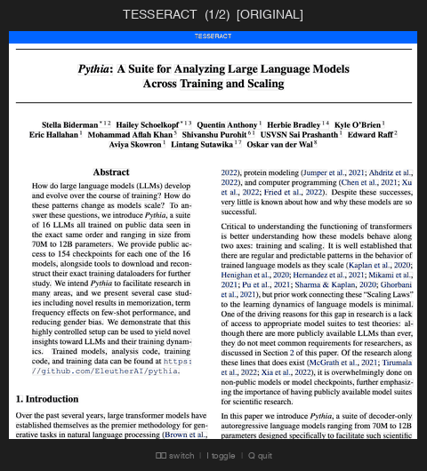
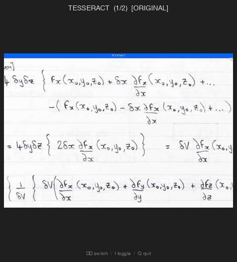
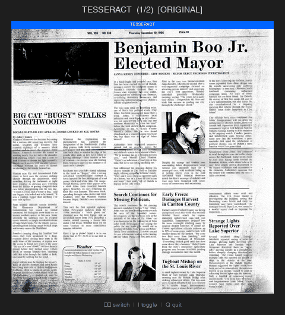

# OCR Comparison System

Compare OCR engines visually. Run Tesseract and EasyOCR on the same image, then flip between results in an interactive viewer to see exactly what each engine detected.

<table>
<tr>
<td></td>
<td></td>
<td></td>
</tr>
<tr>
<td align="center"><em>Academic paper</em></td>
<td align="center"><em>Handwritten math</em></td>
<td align="center"><em>Newspaper</em></td>
</tr>
</table>

## Quick Start

```bash
# Install
cd ocr_comparison
brew install tesseract    # macOS (or: apt install tesseract-ocr)
pip install -e .

# Launch the interactive viewer on any image
ocr-compare view your_image.png
```

This runs both OCR engines and opens a viewer where you can:
- **Arrow keys**: flip between engines (Tesseract vs EasyOCR)
- **I**: toggle between the original image and a "text map" showing what the engine extracted
- **Q**: quit

That's it. One command to see how two OCR engines compare on your document.

## Other Ways to Use It

### Print extracted text

```bash
ocr-compare compare image.png --show-text
```

### Save a static visualization

```bash
# Side-by-side comparison
ocr-compare compare image.png --mode side_by_side -o comparison.png

# Overlay (blue = Tesseract, green = EasyOCR)
ocr-compare compare image.png --mode overlay -o comparison.png

# Diff view (highlights disagreements between engines)
ocr-compare compare image.png --mode diff -o comparison.png

# Margin view (extracted text in a right-side margin with leader lines)
ocr-compare compare image.png --mode margin -o margin.png
```

### Batch process a directory

```bash
ocr-compare batch ./images/ --output-dir ./results
```

### Generate a full report

```bash
ocr-compare report image.png --output-dir ./report --ground-truth "expected text"
```

### Check available engines

```bash
ocr-compare engines
```

## Installation Details

**Python packages** (installed automatically): Pillow, numpy, pytesseract, easyocr

**System dependency** -- Tesseract must be installed separately:
```bash
# macOS
brew install tesseract

# Ubuntu/Debian
sudo apt install tesseract-ocr
```

For development/testing: `pip install -e ".[dev]"`

## Python API

```python
from ocr_comparison import OCRComparator

comparator = OCRComparator()
results = comparator.process_image("image.png")

for engine_name, result in results.items():
    print(f"{engine_name}: {result.word_count} words, {result.average_confidence:.1%} confidence")
    print(result.full_text)
```

See `examples/` for more usage patterns including batch processing and ground truth evaluation.

## Documentation

- [CLI Reference](docs/cli.md) -- all commands and options
- [Python API](docs/api.md) -- data models and programmatic usage
- [Adding OCR Engines](docs/adding-engines.md) -- how to write a new adapter

## License

Apache 2.0
